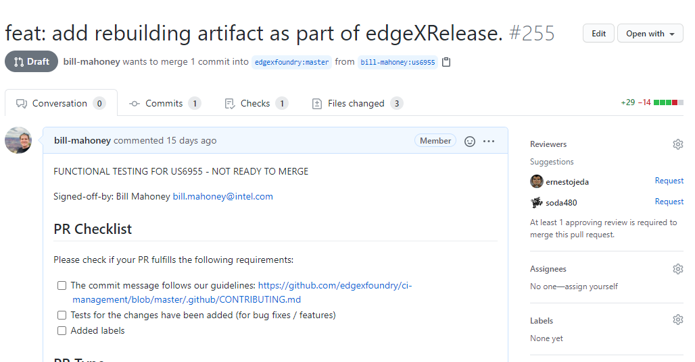

# Pull Request Sandbox Testing

## Introduction
The [EdgeX Jenkins Production Server](https://jenkins.edgexfoundry.org/) and [EdgeX Jenkins Sandbox Server](https://jenkins.edgexfoundry.org/sandbox/) are configured to use the [`edgex-global-pipelines`](https://github.com/edgexfoundry/edgex-global-pipelines) library. The servers target either [`stable`](https://github.com/edgexfoundry/edgex-global-pipelines/tree/stable) or [`experimental`](https://github.com/edgexfoundry/edgex-global-pipelines/tree/experimental) tags for Production and Sandbox servers respectively.

To make functional testing of Jenkins Shared Pipeline Libraries more convenient, you can use a commit hash from a Pull Request into [`edgex-global-pipelines`](https://github.com/edgexfoundry/edgex-global-pipelines) to override the default pipeline version that the Jenkins server is using. (`stable`/`experimental`)

### Step 1 - Create Draft PR

When you have changes you'd like to functionally test, open a Draft Pull Request from your forked repository of `edgex-global-pipelines` into [`edgex-global-pipelines:master`](https://github.com/edgexfoundry/edgex-global-pipelines)

Make clear that this is a PR for functional testing purposes and is not meant to be merged.



### Step 2 - Use PR Commit Hash

Find the commit hash of your draft PR.


Place the commit hash into your Jenkinsfile that is under test. The [EdgeX Sample-Service](https://github.com/edgexfoundry/sample-service) is a good place to functionally test shared libraries without affecting production code.

Add the commit hash after the `'@'` in the explicit library import statement as shown below.

```bash
@Library("edgex-global-pipelines@7eba319") _

edgeXBuildGoApp (
    project: 'sample-service',
    goVersion: '1.15',
    buildExperimentalDockerImage: true
)
```

### Step 3 - Execute Jenkinsfile

When you execute your functional test build job on the sandbox, the commit hash of your PR will be shown as the commit used for the edgex-global-pipeline shared library. You will see a message similar to the following in your build job console output.

```bash
...
Loading library edgex-global-pipelines@7eba319
Attempting to resolve 7eba319 from remote references...
...
```

### Step 4 - Finishing Up

When you are satisfied that the content of your `edgex-global-pipelines` fork is functionally tested and ready to be merged, you can convert your draft PR into a real PR and add the appropriate reviewers.

After your PR is merged to master, the `experimental` tag will point to your newest content. You might want to test your new code by switching back to the `experimental` tag in your Jenkinsfile.

```bash
@Library("edgex-global-pipelines@experimental") _
```

Please clean up and close your PR after you have finished your functional testing.
